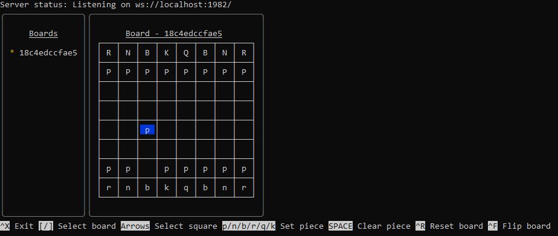

# OEBSP Reference Server

This application provides a reference server for the [Open E-board Server Protocol (OEBSP)](https://home.tornelo.com/e-board-integration/),
intended to assist the developers of Chess client software to test their OEBSP integration.

Running the application will create a OEBSP server on your local machine, and give you access
to an interface from which you can manipulate a simulated e-Board.

## Usage

1. Download the latest releast [from the GitHub releases page](https://github.com/chessworld/oebsp-reference-server/releases/).
2. Run the application. By default it will listen on port 1982, this can be changed by specifying the `PORT` environment variable.

At the top, you will see the status and URL of the server. Below that is a list of boards
and a preview of the current board. At the bottom there is a legend of the available keyboard
shortcuts.

### Using a custom configuration

You can provide a custom configuration JSON file to configure more complex situations such
as multiple boards or different start positions. See the `config` path for examples of custom
configurations.

To use a custom config, provide the path to the config file as the first argument when launching
the server.

### Keyboard shortcuts

The user interface is manipulated entirely with the keyboard. The following actions
are available:

- `Ctrl-X` - Exits the application.
- `[` and `]` - Switches between multiple boards. (not yet supported)
- Up, down, left, and right arrows - Change the selected square on the board preview.
- `p`, `n`, `b`, `r`, `q`, and `k` - Sets the current square to a specific piece. Enter an
  upper-case letter for a white piece or lower-case letter for a black piece.
- Space - Clears the current square.
- `Ctrl-R` - Resets the board to the starting position.
- `Ctrl-F` - Flips the preview of the board by 180 degrees.

## Development

1. Clone the git repo to your local machine
2. Make sure you have Node v14 or later installed
3. Install yarn if you don't already have it
4. Run `yarn start` within the repo directory

### Building

You can run `yarn build` to build new binaries of the application into the `build` directory.
